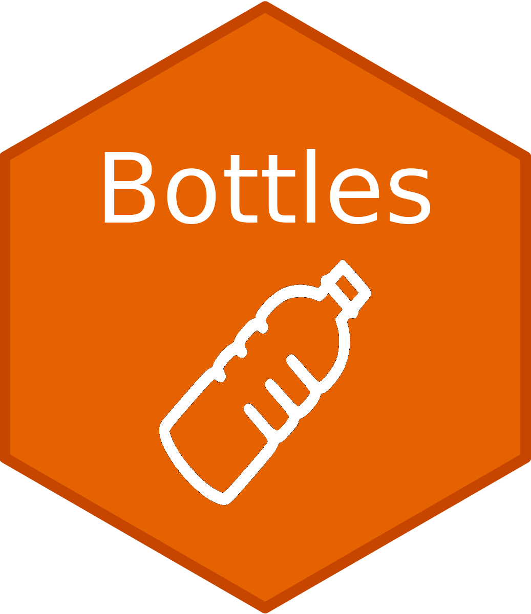

# Bottles - Containerize code snippets 

<!-- badges: start -->
  [](https://lifecycle.r-lib.org/articles/stages.html#experimental)
  <!-- badges: end -->

## Purpose

The main purpose of the tool is to provide an easy what of exporting a small snippet of code else where provided the differences if the installed package versions are compatible.

Provides a very simple tool for exporting/saving code while saving the minimal amount of environment data and packages required to be able to rerun the code.

The main use of the package currently has been to export code snippets for generating ggplots, to provide some independence from package versions of the ggplot objects when exporting figures to be editted later.

This tool is not a replacement packages for modular reusable code like [box](https://klmr.me/box/).

## Installation

The package tries to have as few dependencies to external packages as possible relying on base R to work.

The package can be installed through github.

``` r
remotes::install_github("omiics/bottles")
```


## Basic usage

Create a bottle by putting in any R expression code block.

``` r
library(bottles)

bottle <- bottle_code({
  ggplot(dataset, aes(x = samples, y = counts)) + geom_point()
})

```

The returned object is now a bottle object. Which can be saved to file using `save_bottle` or simply `saveRDS`.

``` r
save_bottle(bottle, "bottle_file.rds")
```

The bottle can then in a later session, or on another machine been read again, and then it bottled code can be run:

``` r
bottle <- load_bottle("bottle_file.rds")

run_bottle(bottle)
```

## How is it bottled?

The expression given to `bottle_code` will simply convert the expression to a string, that can be evaluated later. To make the code more reproducible it will do a quick 'analysis' of the provided code and look for all of the variables and function calls that are included in the expression.

All of the variables are extracted from the current environment, and placed in a new environment including only the variables that where used in the expression.

Each of the functions will be checked for which package/namespace they are from and it will add it to the packages that should be loaded into the bottle.

The bottle is a simple list with a S3 class called `bottle`, which allows the functions of the package to recognize that it what provided a bottle. In the background it is basically a list with 3 elements, code, env and packages.

The bottle could be improved further by considering conflicting package versions, and using more specific imports using box, but for now it will basically limit it self to whole packages. The keywords detected in the code will ignore specific namespace calls like: `ggplot2::ggplot`.

When running the bottle will load all required packages in a similar way to withr's `with_package`, and will unload the package once it has finished (except if the package is already loaded).

### Bottle structure

Printing a bottle shows you the structure of the bottle in a prettified way making it easy to get an overview of what was included in the bottle. 

```
                 [ ]
               .-' '-.
R Code Bottle  :-...-:
           v1  |     |
               |     |
               `-...-' 

── Bottled code: ───────────────────────────────────────────────────────────────────
{
    if (isTRUE(modify_data)) {
        prep_data <- example_data %>% mutate(y = y * 10)
    } else {
        prep_data <- example_data
    }
    p <- ggplot(prep_data, aes(x, y)) + geom_point()
    p + theme_bw()
}

── Bottled packages: ───────────────────────────────────────────────────────────────
dplyr & ggplot2

── Bottled environment: ────────────────────────────────────────────────────────────
modify_data & example_data
```
